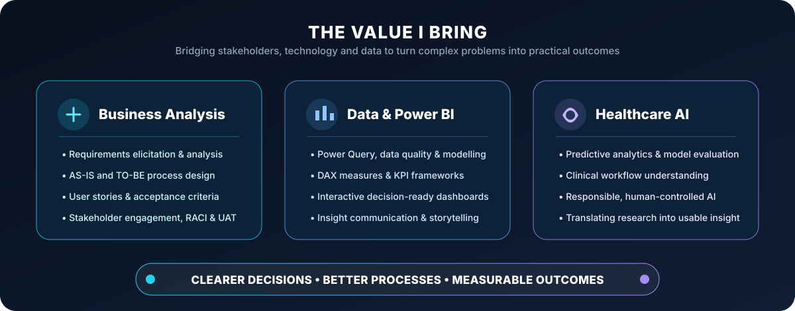
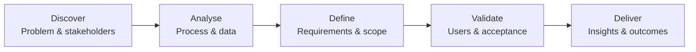

  

<h2>Business Analyst &amp; Data Analyst | Healthcare AI • Power BI • Digital Transformation</h2>

 

### **I turn complex business and healthcare problems into clear requirements, improved processes and decision-ready analytics.**

  
  
  

---

## 👋 Professional Profile

I’m **Subbulakshmi (Subbu)**, a Melbourne-based **Business Analyst and Data professional** working at the intersection of **business needs, technology and analytics**. My background spans **healthcare AI research, technology delivery, supply-chain analytics and business process improvement**.

My key differentiator is the ability to work across the full problem-solving journey: **facilitate stakeholder conversations, translate needs into structured requirements, map AS-IS and TO-BE processes, analyse data, build Power BI dashboards and communicate technical findings in practical business language**.

  

### Recruiter snapshot

| | |
|---|---|
| **Target opportunities** | **Business Analyst, Technical Business Analyst and Data Analyst** roles |
| **Location** | **Melbourne, Australia** — open to relocation across Australia |
| **Core value** | Connecting **stakeholders, processes and data** to support measurable decisions |
| **Domain strengths** | **Healthcare, technology delivery, supply chain and operational analytics** |
| **Featured capability** | **Power BI dashboards, KPI design, process improvement and responsible AI** |

---

## 💼 Experience Snapshot

| Focus Area | What I Deliver |
|---|---|
| **Healthcare Data & AI Research** | Work with predictive modelling pipelines and evaluate Logistic Regression, Random Forest, XGBoost and GAM approaches for healthcare outcomes. |
| **Technical Business Analysis** | Define business problems, analyse processes, elicit requirements, prepare user stories and support Agile technology delivery. |
| **Supply Chain & Operations Analytics** | Build procurement dashboards, analyse supplier lead times and support the digitisation of operational check-off and quotation processes. |
| **Stakeholder Communication** | Translate between business and technical teams through workshops, documentation, presentations and data storytelling. |

---

## ⭐ Power BI Spotlight

My Power BI work is built around business decisions—not just visual design.

<table>
  <tr>
    <td width="25%" align="center"><b>Prepare</b> Clean, transform and validate data</td>
    <td width="25%" align="center"><b>Model</b> Build relationships and measures</td>
    <td width="25%" align="center"><b>Visualise</b> Design clear KPIs and dashboards</td>
    <td width="25%" align="center"><b>Communicate</b> Turn analysis into action</td>
  </tr>
</table>

### Selected analytics applications

- **Healthcare:** clinical outcome analysis and operational performance reporting.
- **Supply chain:** supplier lead time, delayed orders, procurement visibility and vendor performance.
- **Operations:** service performance, workflow monitoring and decision-support dashboards.

---

## 🧭 How I Approach Business Analysis

My approach keeps the **business problem, stakeholder value and measurable outcome** visible throughout delivery.

---

## 🚀 Featured Work

### 🏥 CarePath — Healthcare Business Analysis Case Study

**Building an end-to-end portfolio case study for AI-assisted outpatient referral management.**

| Business Need | BA Evidence |
|---|---|
| Improve referral completeness, routing, visibility and operational reporting | Problem statement, project objectives, scope boundary, stakeholder register, Power–Interest Matrix, RACI and AS-IS process analysis |
| Introduce responsible administrative AI support | Human-controlled clinical decisions, clear exclusions and responsible-AI boundaries |
| Make performance measurable | Planned Power BI analysis using fully synthetic healthcare operations data |

### 🤖 JARVIS — Local AI Assistant for macOS

Developed a Python-based personal assistant with voice interaction, local AI through Ollama, application controls, reminders and productivity features. This project demonstrates requirements translation, iterative development, troubleshooting and user-centred feature design.

### 📊 Data Analytics Portfolio

Explore my projects across Power BI, healthcare analytics, supply chain, operations, R, Python and machine learning.

---

## 🎯 Current Professional Development

<table>
  <tr>
    <td width="33%" align="center" valign="top">
      
        
      <b>Microsoft Fabric Analytics Engineer</b>
       Lakehouses, warehouses, semantic models, security and Power BI integration
    </td>
    <td width="33%" align="center" valign="top">
      
        
      <b>Entry Certificate in Business Analysis</b>
       Elicitation, requirements lifecycle, strategy analysis and solution evaluation
    </td>
    <td width="33%" align="center" valign="top">
      
        
      <b>Responsible Healthcare AI</b>
       Predictive modelling, clinical applications, evaluation and responsible adoption
    </td>
  </tr>
</table>

> **Status matters:** DP-600 and ECBA are shown as current preparation—not completed certifications.

---

## 🛠️ Skills & Tools

### Business Analysis and Delivery

### Data, BI and Engineering

---

## 📈 GitHub Overview

  

  
  

  

---

## 🤝 Let’s Build Something Valuable

I’m interested in opportunities and collaborations involving
**Business Analysis, Data Analytics, Power BI, Microsoft Fabric, Healthcare AI and Technology Consulting**.

 

  

